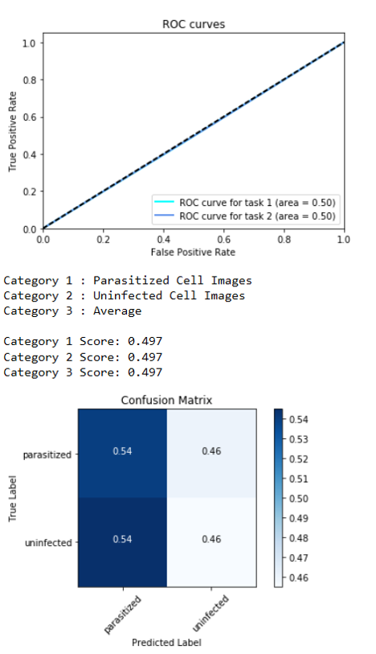

# Malaria-Detector-CNN
This project is a 3-layer, fully connected Convolutional Neural Network (CNN) designed to detect cell images which have been parasitized with malaria.  This is my capstone project for Udacity's Machine Learning nano-degree.

## Background
This project was inspired by a Kaggle competition project called <a href="https://www.kaggle.com/iarunava/cell-images-for-detecting-malaria">“Malaria Cell Images Dataset - Cell Images for Detecting Malaria”</a>. The intent is to save humans by developing an algorithm to determine whether image cells show infestation by malaria. The dataset of images (which actually comes from the NIH) contains cell images in two categories – those parasitized by malaria and those uninfected.

Malaria is “a mosquito-borne disease caused by a parasite. People with malaria often experience fever, chills, and flu-like illness. Left untreated, they may develop severe complications and die. In 2016 an estimated 216 million cases of malaria occurred worldwide and 445,000 people died, mostly children in the African Region. About 1,700 cases of malaria are diagnosed in the United States each year. The vast majority of cases in the United States are in travelers and immigrants returning from countries where malaria transmission occurs, many from sub-Saharan Africa and South Asia.” Ref <a href="https://www.cdc.gov/parasites/malaria/index.html">“CDC Malaria website”</a>.

## Algorithm Class :
3-layer, fully connected Convolutional Neural Network (CNN)

## Problem Type
Classification of large dataset (>27K images)

## Results

### Benchmark
A benchmark was established using a 1-layer CNN.  The model design is shown in Appendix A.

Accuracy : 89.95%

Receiver Operating Characteristics (ROC) and Confusion Matrix

### 3-layer fully connected CNN

Accuracy : 95.17%

Receiver Operating Characteristics (ROC) and Confusion Matrix

# Project Instructions
1. Clone the repository and navigate to the downloaded folder.

~~~~
git clone https://github.com/davidsprice/Malaria-Detector-CNN
~~~~

2. Create and activate a new environment.

~~~~
conda create -n malaria-detector-cnn python=3.6 matplotlib numpy pandas keras-gpu
source activate malaria-detector-cnn
~~~~

3. Pre-processing Steps

First, download the image set from <a href="https://www.kaggle.com/iarunava/cell-images-for-detecting-malaria">“Malaria Cell Images Dataset - Cell Images for Detecting Malaria”</a>, and then establish the following folder structure of the same folder in which the notebook is being run.
            
Structure for full image set (>27k images):
   * /cell_images_full
        * /train
            * /parasitized - 9645 images
            * /uninfected - 9645 images
        * /test
            * /parasitized - 2756 images
            * /uninfected - 2756 images
        * /valid
            * /parasitized - 1378 images
            * /uninfected - 1378 images

Structure for subset image set (200 images) for rapid code development:
   * /cell_images_subset
        * /train
            * /parasitized - 70 images
            * /uninfected - 70 images
        * /test
            * /parasitized - 20 images
            * /uninfected - 20 images
        * /valid
            * /parasitized - 10 images
            * /uninfected - 10 images

For a complete listing of how the images were divided between the train, validation, and test datasets, refer to the following files:
   * /ground_truth_files/ground_truth_full - COMPLETE.xls
   * /ground_truth_files/ground_truth_subset - COMPLETE.xls

Also, create the following subfolders in the same folder in which the notebook is being run:
   * /prediction_files - for storing the prediction from the models using the test set of images
   * /ground_truth_files - for storing the "truth" of image classification (parasitized or uninfected)
   * /saved_models - for storing the best weights from each model

4. Create an [IPython kernel](https://ipython.readthedocs.io/en/stable/install/kernel_install.html) for the malaria-detector-cnn environment.

~~~~
python -m ipykernel install --user --name malaria-detector-cnn --display-name "malaria-detector-cnn"
~~~~

5. Open the notebook.

~~~~
jupyter notebook Malaria-Detector_CNN.ipynb
~~~~

6. Before running code, change the kernel to match the malaria-detector-cnn environment by using the drop-down menu (Kernel > Change kernel > malaria-detector-cnn). Then, follow the instructions in the notebook.

7. You will likely need to install more pip packages to complete this project. Please curate the list of packages needed to run your project in the requirements.txt file in the repository.

# Appendices

## Appendix A - Benchmark 1-layer CNN model design
The model design is shown below:

    #Initialize the CNN
    benchmark_model = Sequential()

    #Add convolution layer
    benchmark_model.add(Conv2D(32, (3, 3), input_shape = (64, 64, 3), activation = 'relu'))

    #Add pooling layer
    benchmark_model.add(MaxPooling2D(pool_size = (2, 2)))

    #Add flattening layer
    benchmark_model.add(Flatten())

    #Add fully connected layer
    benchmark_model.add(Dense(units = 128, activation = 'relu'))
    benchmark_model.add(Dense(units = 2, activation = 'softmax'))

    #Compile the CNN
    benchmark_model.compile(optimizer = 'adam', loss = 'binary_crossentropy', metrics = ['accuracy'])
    
## Appendix B - 3-layer fully connected CNN model design
The following structure was estalished for the model:

    #Initialize the CNN
    model = Sequential()

    #Add 1st convolutional layer
    model.add(Conv2D(32, (3, 3), input_shape = (64, 64, 3), activation = 'relu'))
    model.add(MaxPooling2D(pool_size = (2, 2)))

    #Add 2nd convolutional layer
    model.add(Conv2D(32, (3, 3), activation = 'relu'))
    model.add(MaxPooling2D(pool_size = (2, 2)))

    #Add 3rd convolutional layer
    model.add(Conv2D(32, (3, 3), activation = 'relu'))
    model.add(MaxPooling2D(pool_size = (2, 2)))

    #Add fully connected layer
    model.add(Dropout(0.3))
    model.add(Flatten())
    model.add(Dense(units = 128, activation = 'relu'))
    model.add(Dropout(0.3))
    model.add(Dense(units = 2, activation = 'softmax'))

    #Compile the CNN
    model.compile(optimizer = 'adam', loss = 'binary_crossentropy', metrics = ['accuracy'])
